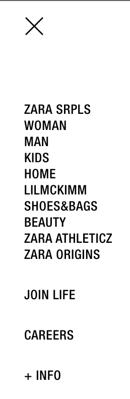
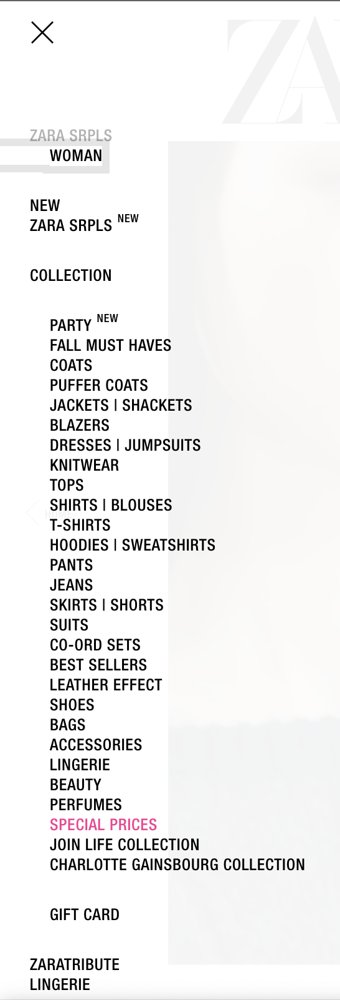
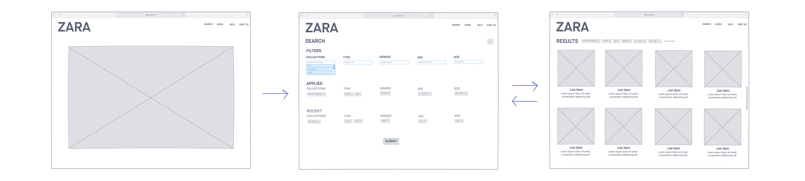

# Analyzing and Redesigning Zara’s Website
By Anne Noonan

## 1 INTRODUCTION 

The interface I have chosen to redesign is the Zara website on an internet browser.
Zara is a clothing brand that sells clothes online to a variety of customers. Its
website is accessible through the following link: https://www.zara.com/us/. When
the user clicks on the hamburger menu icon, a dropdown list opens and options
to filter for various content is listed (see Figure 1). Once the user clicks on one of
the options, the dropdown updates to content specific to that filter (see Figure 2).

<em style="  display:block;margin-left: auto;margin-right: auto;width: 50%;">Figure 1: Initial view of the Zara dropdown menu</em>

<em style="  display:block;margin-left: auto;margin-right: auto;width: 50%;">Figure 2: View of the Zara dropdown menu when the user clicks a
filter (in this example, the user clicked the filter for “WOMAN”</em>

## 2 INITIAL NEEDFINDING

To gather more information about what possible improvements can be made to
the content filtering option of the Zara website interface, the following problem
space and user types need to be explored. Interviews will be conducted with several participants and the product reviews of the application will be reviewed
to further understand these users’ needs from the context of this problem space.

### 2.1 PROBLEM SPACE

Users, particularly those who are conducting online shopping for clothing, require
the ability to filter for relevant content. Whether they wish to filter by gender, age,
or fashion line, users are inundated with the many items available for sale on
Zara’s website. Therefore, the ability to dynamically filter to display content
relevant to their search is vital to them being able to browse, select, and purchase
clothes with the best experience possible.

Several issues exist with the current design of Zara’s website. The words in the
dropdown menu overlap the images displayed on screen making the filters
difficult to read, the words within the dropdown menu are small and difficult to
read relative to the rest of the content displayed on the page, et cetera. However,
the main issue is that the spacing between filters and the overall layout of the menu
is confusing for users to understand how the filters are sorted. Also, upon selecting
filters, it is difficult to determine what filters are being applied to the content
displayed on screen. The target domain is to enable users to understand the filters
available to them, understand filters applied to the displayed content currently,
and dynamically adjust them as their shopping needs evolve.

### 2.2 USER TYPES

In the United States alone, 69% of the population has shopped online and 25%
shop online at least once per month (Ouellette, 2021). Most of these shoppers (59%)
bought clothing items (Ouellette, 2021). Men and women equally shop online
(Smith, 2015). In terms of age, millennials (age 18 – 34) spend more money online
than any other age group but also, one in four shoppers in the US is over the age
of 55 (Smith, 2015). Therefore, given these statistics, the age population of users to
be surveyed is anyone over the age of 18 and there will be no gender isolated for
this project. In terms of motivations, these users are interested in browsing and
potentially buying clothing related items online through a browser from Zara.
They may have varying levels of expertise with technology, but overall, they are expert shoppers (meaning they have shopped frequently for items in the past, whether that be online or in brick-and-mortar stores).

### 2.3 INTERVIEWS

I will interview five participants to understand the needs of users of Zara’s website. The interview will be semi-structured to enable further open-ended
exploration of this interface.

#### 2.3.1 SELECTING INTERVIEW PARTICIPANTS

In this exercise, I will select users who are at least 18 years old and who have purchased clothes online in the past, as they are proxy users for Zara’s website.
They will have experience in online shopping but not necessarily with Zara’s website, which will help target the needs of a novice user (as online shopping
should require no learnability). They were recruited through my family and friends.

#### 2.3.2 PERFORMING THE INTERVIEW

The interview will begin by asking how the participant like to filter for relevant clothing. To transition to the specific experience regarding Zara’s website, I will
ask them to navigate the Zara’s website for clothes relevant to them. I will take notes of what actions and particular filters they perform on the website to filter for content relevant to them. I then will ask them to reflect on their experience and what they particularly liked or disliked about the experience, particularly with
regards to filtering.

#### 2.3.3 INTERVIEW QUESTIONS

1. What websites do you typically use when online shopping for clothes?
2. What sort of “filters” do you use when you shop for clothing in brick-and-
    mortar stores?
3. What sort of filters do you prefer on online clothing shopping sites to
    ensure only relevant content is displayed?
4. What devices to you typically use to online shop?
5. When you online shop, what is typically going on around you?
6. Who are you typically shopping for?
7. How often do you adjust filters while browsing for clothes online?
8. Browse for clothes on Zara’s website for five minutes. What do you think
    of your experience, particularly with being able to find relevant content
    and, if used, being able to use filtering?

#### 2.3.4 DATA INVENTORY

The following is a data inventory of what the interview is attempting to address
and which interview question (IQ) maps to each data inventory item.

1. Who are the users? ( _IQ1, IQ2, IQ 5 , IQ 6 , & IQ 8_ )

    Users are men and women age 18 and older. They are motivated by
    efficiency—how can they find relevant clothes in a limited amount of time
    and use filters to expedite that experience. They may have varying levels
    of expertise with fashion terminology and with abilities (e.g., eye sight and
    focus).
2. Where are the users? ( _IQ 5_ )
    
    Typically, the user is at home, at work, or in social settings.
3. What is the context of the task? ( _IQ 1 , IQ4, IQ5, IQ6, & IQ7_ )
    
    The users are using their laptops, desktop, and phones to browse for
    content. They are typically shopping for themselves. They typically have a
    particular item in mind to purchase and do not browse for pleasure rather
    than with a goal.
4. What are their goals? ( _IQ2, IQ 3 , & IQ 6_ )
    
    To find clothing items that they are looking for in terms of cut, style, size,
    and price as efficiently as possible. They are motivated by convenience.
5. What do they need? ( _IQ2, IQ 3 , IQ 4 , IQ5, & IQ 6_ )

    An easy way to navigate the site and filter for relevant content. A smooth,
    simple layout so they can focus on the shopping task at hand
6. What are their tasks? ( _IQ7 & IQ8_ )

    Buy clothing relevant to them
7. What are their subtasks? ( _IQ7 & IQ8_ )

    Browse for relevant clothing. Compare relevant clothing. Select relevant clothing. Purchase relevant clothing.

#### 2.3.5 POTENTIAL BIASES

There are several sources of potential bias in this needfinding method. First, I
recruited from my family and friends so there is potential for social desirability
bias. I tried to mitigate this by trying to give them free reign of using the website
with limited prompting. However, I had to intercede to give instructions as the
homepage was not intuitive for filtering and browsing for content. In this regard,
there is a potential for confirmation bias as I am interceding in on their experience
on navigating through the website. I tried to be impartial to mitigate this and
enable them to choose freely between the search bar versus hamburger filtering
methods. There is also potential for recall bias because the initial questions
surround the user’s reflection on their previous experience. This is mitigated by
observing the user’s behavior in the eighth question of the interview. The last
potential bias is observation bias—the user may act differently given they are
being observed. This bias was difficult to mitigate.

### 2.4 PUBLIC REVIEW ANALYSIS

I reviewed both a summary from a UI/UX designer’s evaluation of online clothes
store websites and 100 online reviews of Zara through Trust Pilot (filtering those
that mention the website in the review).

#### 2.4.1 SUMMARY

Overall, the website is not responsive as it does not render well on a variety of
devices and window or screen sizes (Li, 2020). Predominantly, complaints about
the website focused upon the filtering and search capabilities of the website. Below
is a summarized list of findings:

- Filters for number of products to show per row do not work (Li, 2020)
- Missing breadcrumbs and list entirety of categories on side which is
    confusing (Li, 2020)
- Colors are written out rather than colored (Li, 2020)
- Cannot chose more than one filter (Li, 2020)
- App/website is not easy to navigate given poor filters. Users must
    extensively browse in order to find something they’re looking for ( _Zara is_
    _rated “bad” with 1.4 / 5 on Trustpilot_ 2021 )
- Website is not easy to use especially when using a phone ( _Zara is rated “bad”_
    _with 1.4 / 5 on Trustpilot_ 2021 )
- Landing page and difficulty in getting into the categories is difficult for
    searching ( _Zara is rated “bad” with 1.4 / 5 on Trustpilot_ 2021 )
- Scrolling through items is very difficult due to random popups, difficulty
    scrolling, uneven use of images, completely asymmetrical images.
    Scrolling is nearly endless ( _Zara is rated “bad” with 1.4 / 5 on Trustpilot_ 2021 )
- Navigating back to the filter menu takes you to another random item or
    page and doesn’t navigate the user back to where they were ( _Zara is rated_
    _“bad” with 1.4 / 5 on Trustpilot_ 2021 )
- Lack of variety of size filters ( _Zara is rated “bad” with 1.4 / 5 on Trustpilot_
    2021 )
- Size of text difficult to read, difficult to use for the visually impaired ( _Zara_
    _is rated “bad” with 1.4 / 5 on Trustpilot_ 2021 )
- Can’t sort search results ( _Zara is rated “bad” with 1.4 / 5 on Trustpilot_ 2021 )
- App is not intuitive to use ( _Zara is rated “bad” with 1.4 / 5 on Trustpilot_ 2021 )

#### 2.4.2 DATA INVENTORY

The following is a data inventory of what the interview is attempting to address.

1. Who are the users?

    Users are men and women age 18 and older. They are motivated by
    efficiency, particularly how easy it is to navigate the website
2. Where are the users?

    Worldwide
3. What is the context of the task?

    They particularly shop to buy rather than browse for content.
4. What are their goals?

    To find clothing items that they are looking for in terms of cut, style, size, and price as efficiently as possible. They are motivated by convenience.
5. What do they need?

    An easy way to navigate the site and filter for relevant content. A smooth,
    simple layout so they can focus on the shopping task at hand
6. What are their tasks?

    Buy clothing relevant to them
7. What are their subtasks?

    Browse for relevant clothing. Compare relevant clothing. Select relevant
    clothing. Purchase relevant clothing.

#### 2.4.3 POTENTIAL BIASES

The potential for response bias is the biggest source of possible bias for this
needfinding method. The overall score of Zara was 1.4/5, which is a negative score.
Those that are upset with the service of a company are more likely to write a
review, and as they are upset, the review is most likely to be negative. Also, as I
was reviewing the responses, there is potential that I am picking reviews that
confirm my own beliefs about the problem space (an example of confirmation
bias). To mitigate this, I tried to review every comment that mentioned the website
and then parsed them, making notes to ensure that each point was captured,
almost to the extent of including irrelevant information to this problem space.

### 2.5 SUMMARY OF FINDINGS

Most users use Amazon or Walmart when online shopping for clothes. Filters they
use between online shopping for clothes versus shopping in brick-and-mortar
stores. Users prefer to shop sales, by price, type of item, and brand. They shop by
convenience, both through phone, desktop, and laptop. They are typically focused
on their task, or shopping while at work or school. They adjust filters when content
displayed is not relevant. They typically shop for themselves or their family. They
used the search bar moreso than the hamburger but had difficulty finding where
to search for content. The spacing is very important, and visually impaired people
have difficulty using the search and filtering functionality, implying there is room for improvement for font size, color, and spacing. Navigating the website is
difficult, particularly for reversing through navigation. Their needs are as follows,
which include improvements to the existing interface rather than new features:

- Inclusive design for the visually impaired
- Ability to understand filters and apply them as needed
- Ability to revert filter settings
- Flexibility of filtering methods

## 3 HEURISTIC EVALUATION

There are nine basic principles of usability involved in a heuristic evaluation
(Nielsen & Molich, 1990). They are as follows: simple and natural dialogue, speak
the user’s language, minimize the user’s memory load, be consistent, provide
feedback, provide clearly marked exits, provide shortcuts, good error messages,
and prevent errors. Zara’s filtering interface will be evaluated against these
principles.

### 3.1 SIMPLE AND NATURAL DIALOGUE / SPEAK THE USER’S LANGUAGE

To some extent, the language used on Zara’s website is **simple** and natural,
following the user’s language. However, there are deviances that vary enough to
confuse the user. This includes use of phrases such as “Zara Srpls,” “Co-ord sets,”
“Join life collection,” “Zarattribute,” “Zara Origins,” and “Zaraseries.” These
phrases are not intuitive to the user, as the differences between these “collections”
or filters in the dropdown are nuanced and not natural words or spellings to
indicate to the user what these collections or filters mean.

### 3.2 MINIMIZE THE USER’S MEMORY LOAD

When the user clicks a filter in the drop down, the menu disappears, and the user
must click the dropdown menu again to see what filters are selected in terms of
categories. While the users’ selections are saved thus minimizing the user’s
memory load, they are not immediately aware or reminded of what current
categorical filters are applied until clicking on the dropdown.

### 3.3 BE CONSISTENT

There are two predominant issues with **consistency**. One is the lack of simple and
natural language—the words that the user encounters as categorical filters are not
intuitive to the user as they are not consistently used in any context outside of the
Zara website/company.

The other issue is the lack of consistent spacing and sorting of categories in the
dropdown menu. There is a parent category, “Collection,” which contains several
subcategories such as Party, Fall Must Haves, and Best Sellers, as well as categories
such as Pants, Jeans, Suits, Shoes, Bags, etc. One would argue that these categories
are not mutually exclusive nor consistent. Under Fall Must Haves, there are pants,
jeans, sweaters, etc. Jeans are a type of Pants, but they are separate categories, yet
jeans are included in the Pants category. The main issue here is that the filters are
confusing with their lack of consistency of exclusivity. It’s not consistent with what
the user understands that categorical filter to mean according to their experience
and it is not consistent within the Zara dropdown either. One would argue that
Jeans are not a collection, but that Party is. Therefore, categories aren’t consistent
and make selection difficult for the user. Also, there’s the issue that collections are
listed in the dropdown outside of the Collections parent, such as Studio Collection,
Zara Origins, and Charlotte Gainsbourgh Collection as well as categories being
listed both under the Collections parent as well as on their own, such as Lingerie.

### 3.4 PROVIDE FEEDBACK / GOOD ERROR MESSAGES / PREVENT ERRORS**

There is **limited feedback** provided within the context of the search bar which
increases the **gulf of evaluation** —how does the user know if their filters have been
applied in the way they predicted? When the user types in a search term, if the
word is included in a particular substring of a word, it will appear in a dropdown
menu. However, if it does not, there is not any suggestion for what might yield to
a user a successful search experience. It only shows the user that there are no
results. It does not suggest what filters are available to the user, although clearly,
there is a limited library of search terms available to the user, but this is not
indicated nor displayed in exhaustion. It encourages the user from typing in search
terms that do not exist and does not provide them the context of what filters would result in more search results. The screen does not show what filters are applied
unless the Filter option is open (checkmarks are displayed) or the dropdown menu
is displayed.

### 3.5 PROVIDE CLEARLY MARKED EXITS

When clicking the Search option, the user has no clear exit for how to exit this
screen. They must use the browser back buttons to navigate back to their previous
page, which does not necessarily take them back to their original view. However,
with the dropdown menu, there is a clear indication of how to exit the sidebar—
there is an “X” icon. With the Filters option, the user can unclick a checkmark to
remove the filter, which is a clearly marked exit. There is also no clear way to not
indicate a gendered filter.

### 3.6 PROVIDE SHORTCUTS

The site provides several shortcuts to the user—the dropdown, search bar, and
filters options. These all enable the user to apply filters in varying ways, which
provides the user shortcuts to filtering.

## 4 INTERFACE REDESIGN

The following is a card prototype of the interface redesign.

### 4.1 ZARA HOMEPAGE

The first card is a simplistic redesign of the Zara homepage (Figure 3). The
hamburger icon and the filter option, typically not immediately noticeable to
users, are eliminated. Only the Search option remains, yet it combines the abilities
of the eliminated dropdown categorical menu and the filter options, as will be
clear in Card 2.

<em style="  display:block;margin-left: auto;margin-right: auto;width: 90%;">Figure 3: Card 1, Card 2, and Card 3, the redesigned Zara homepage, redesigned Zara search page, and redesigned Zara search results page</em>

### 4.2 SEARCH / FILTER PAGE

The second card is a near-total redesign of the Zara search view (Figure 3). There
are three sections: filters, applied, and recent. In the filters section, there are
dropdown menus for Collections, Type, Gender, Age, and Size. The user has the
option of adding as many or as few filters as they wish, and filters are categorized
for them into those five buckets. The dropdowns enable the user to see what
options for filtering are available to them using the dropdown menus for each
subsection of filter types.

In the applied section, the user can see what filters are currently being applied.
They can eliminate those filters by clicking the “X” icon on the relevant filter tag.
They can also see under which category that filter belongs as well, in case they
want to add additional filters that are similar.

In the Recents section, the text is grey so the user visually can see that the filters
are not being applied currently. They understand that these are filters that have
been recently applied in the past in their relevant categories. The user can delete
them from the Recents category if they wish by clicking the “X” icon on the
relevant tag.

### 4. 3 SEARCH RESULTS PAGE

The third card is a subtle redesign of the Zara search results page (Figure 3). It lists
the filters that are applied at the top of the screen and allows the user to eliminate
the filter as they wish by clicking the “X” icon on the filter tag. The page will
dynamically load and adjust the displayed content based on the user’s actions. If
the user wishes to add additional tags or return to the search page to edit their
selections, they can do so by clicking the “Adjust Search” option.

## 5 INTERFACE JUSTIFICATION 

This interface redesign addresses many of the requirements as outlined in the
needfinding exercise and the heuristic evaluation.

### 5 .1 FULFILLING THE NEEDFINDING REQUIREMENTS

This interface redesign addresses many of the requirements as outlined in the
needfinding exercise with the following:

**Requirements and How They'll Be Addressed:**
1. Inclusive design for the visually impaired the font size is larger, and shapes are used to more clearly display applied filters
2. Ability to understand filters and apply them as needed
3. Filters have been simplified/grouped together for clarity and sorted into relevant categories for the user to better understand their meaning
4. Ability to revert filter settings The user is provided with multiple means of removing filter settings both with the “X” buttons in the filter tags as well as the “Adjust Search” button
5. Flexibility of filtering methods The search parameters are saved, and the user can adjust the search parameters with the “Adjust Search” button. Also, the user can apply multiple filters such as multiple collections if they wish

### 5.2 ADDRESSING FINDINGS IN THE HEURISTIC EVALUATION

In the heuristic evaluation, multiple positive and negative aspects of the interface
were noted. This prototype addresses those principles outlined in the evaluation.

#### 5.2.1 SIMPLE AND NATURAL DIALOGUE / SPEAK THE USER’S LANGUAGE

The filters have been **simplified** to consolidate similar filters into a grouped filter,
such as Pants and Jeans and Knitwear, Hoodies, and Sweatshirts, etc. This makes
the mappings of filters more intuitive for the user. Also, in case the user is a fan of
shopping by collection and like the new-age language of collections such as “Zara
Srpls” and “Zarattribute,” they can now filter by whichever collections they wish
with the collections categorical filter. The user can now understand that these are
collections rather than puzzle at what that filter could possibly mean. This is
addressed through the concept of mapping.

#### 5.2.2 MINIMIZE THE USER’S MEMORY LOAD

When the user decides which filters they wish to apply, the filters applied are
displayed at the top of the screen of their search results page and saved in case
they decide to adjust the search parameters and return to the filtering/search page.
Also, the Recents section on the filtering/search page helps the user remember
filters they’ve used in the past and which categories they were under, in case they
wish to revisit those filters. This **minimizes the user’s memory load** in trying to
remember which filters are applied and which filters they’ve applied in the past.

#### 5.2.3 BE CONSISTENT

The categorical filters have been addressed in 5.2.1. The re-sorting and
categorization of these filters help the user to have a **consistent** filtering experience
that they’ve had on other online clothing store sites.

The other issue regarding lack of consistent spacing and sorting of categories in
the dropdown menu have been addressed with the structuring design principle.
The user understands moreso what the parent category relationship of each filter
is by the category listed above the relevant dropdown of children filters. The
inconsistent spacing has been eliminated. Also, by sorting filters into relevant
categories, users can better understand what the function of each filter does. Their
mutual exclusivity of filters is addressed because the user can now use multiple
filters at once to tailor their search results. If they wish to view the Fall Must Haves
collection and particularly, only pants, they can apply those filters. Also, the user
can access all filtering requirements from a single page, rather than have three
options of using a hamburger icon/sidebar menu, a search bar with limited key
terms, and another filters button. Everything has been consolidated to make the
user’s experience consistent.

#### 5.2.4 PROVIDE FEEDBACK / GOOD ERROR MESSAGES / PREVENT ERRORS

Originally, the lack of **feedback** increased the **gulf of evaluation** for users as if
they used the search bar, the library of key terms was limited to a select few, and
essentially a limited subset of the library is displayed to the user given they type
in a few characters. To prevent the user from searching for a filter that doesn’t
exist, the user is now aware of what filters do exist using dropdown menus that
display to the user all options available for them to filter. This prevents the user
from making an error/mistake of typing in a filter that is not supported by Zara.

A positive of the interface, however, was that this search screen did show which
filters are applied, but only when the Filter option is open (checkmarks are
displayed) or the dropdown menu is displayed. That is addressed via tags on the
search results page as well as on the filter/search page in the Applied section.

#### 5.2.5 PROVIDE CLEARLY MARKED EXITS

The user now has a clear path for exiting the search parameters page and not
applying their changes with the “X” button on the top left of the page. The user
can also alternatively press submit and their changes to the filters will be applied
and saved in case they wish to return to the page to adjust them. There are also
more inclusive filters and enable the user to select a gendered / size filter if they
wish, but these filters are not assumed as they were in the original design.

#### 5.2.6 PROVIDE SHORTCUTS

The site already provides several shortcuts to the user—the dropdown, search bar,
and filters options. These all enable the user to apply filters in varying ways, which
provides the user shortcuts to filtering. While this functionality has been
simplified into a single search/filtering page now which would limit the number
of shortcuts, more shortcuts are applied by allowing the user to exit the filtering
page without saving changes and remove filters dynamically while reviewing the
search results.

## 6 EVALUATION PLAN

### 6.1 PROCESS

The prototype will be evaluated via a qualitative evaluation using an interview.
The participants will be my colleagues from work and my family, due to ease of
proximity and their user type similarity to those focused upon in the needfinding
exercise. They will be recruited through text message. I will interview 3-5 people.
The interviews will be conducted virtually and in-person. For virtual interviews,
the link to the Zara site will be sent via email along with an image of the card
prototype as displayed in section 4. First, I will ask the user to use the Zara website
to browse for clothing for about 2 – 5 minutes. Then, I will ask them about their
experience using the site. Then, I will ask them to review my prototype. I will ask
them to guide me through their thoughts on the process and cards of the
prototype. I then will ask them for their final feedback regarding the prototype
and ask them if it fulfills the requirements outlined in section 2.5. All sessions will be recorded through audio on my phone and I will take notes on visually what is
happening.

This interview is semi-structured to enable the user to guide me through their thought process and what they believe is important in terms of the prototype and if additional needfinding or redesigns are necessary for the interface. Questions I plan on answering include:

1. Do you find the interfaces easy to navigate?
2. Are you able to understand filters and apply them as needed?
3. Are you able to dynamically revert and change filter settings?
4. What options for filtering are available and do you find them sufficient?

### 6 .2 DATA INVENTORY / REQUIREMENTS

The four questions listed at the bottom of section 6.1 address the requirements of:

1. Inclusive design for the visually impaired
2. Ability to understand filters and apply them as needed
3. Ability to revert filter settings
4. Flexibility of filtering methods

While this exercise will probably not provide answers to some of the data
inventory questions such as who or where the users are, special attention will be
paid to the environment in which they are conducting the interview as to
understand the context of their task. In asking them question 4 in section 6.1, I will
better understand what their goals and needs are while they provide context as to
the sufficiency to which the options satisfy them. I will make note of what their
tasks and subtasks are while observing them use Zara’s website and noting their
comments on the prototype.

### 6.3 POTENTIAL BIASES

There are a few sources of potential bias in this evaluation plan. First, I recruited
from my family and friends so there is potential for social desirability bias. I tried
to mitigate this by trying to give them free reign of using the website with limited
prompting and also by preparing my structured questions in advance. There is also potential for recall bias because the initial questions surround the user’s
reflection on their previous experience. This is mitigated by observing the user’s
behavior as well as asking them about their experience immediately after using
the interface in question. The last potential bias is observation bias—the user may
act differently given they are being observed. This bias is difficult to mitigate given
how unnatural the virtual interviews can be.

## 7 EVALUATION EXECUTION

Overall, four participants took part in the evaluation exercise. The raw results
(notes) from the investigation are included in Appendix 9.2.

### 7.1 REFLECTION

The sessions went well, but because they were all conducted virtually, there were
at times technical difficulties/issues with tech fluency on behalf of the participants
and the video conferencing software. In the future, in-person interviews would be
preferred to mitigate any tech/tech fluency issues. All the sessions were the
essentially same and followed the same structure, except for asking some
clarifying questions where necessary and answering questions that the
participants asked or giving them additional clarification on an interface.
Organizationally, the same flow would be followed. One change would be to
include a bit more context to the participants initially on what a card prototype is
and how it works so that more relevant feedback can be collected more efficiently.
Also, designing and using a higher fidelity prototype design could enable the
users to be able to interact with the site so that the comparison between the Zara
website and the prototype are clearer. Many participants were confused and could
not get a feel for the site because of the lack of interactivity of the prototype.

### 7.2 SUMMARY

The raw results are included in Appendix 9.2. Participant 1 was not a fan of the
original Zara interface in that the filters did not work as expected (e.g., the jeans
filter did not just show denim pants but also showed denim backpacks and other
irrelevant results). They did not like that the site assumed certain filters, particularly around gender. Also, the interface did not reveal which filters were
available to them and they had difficulties navigating categories. For the
prototype, they were confused about age filter. They understood mappings better
between filters due to the parent category and liked the ability to save searches
and navigate the site. They liked the dynamic filter adjustment on the results page
and wished for more subfilters.

Participant 2 thought the Zara interface was easy to navigate but wasn’t a fan of
how some filters were assumed by the site (gender). They thought the prototype’s
inclusion of the collections filter was confusing and didn’t like the age and size
filtering. Dynamic adjustment of filters/subfilters available to them would be ideal.

Participant 3 did not like that the Zara site did not have intuitive filters and often
could not come up with filter combinations that would allow them to receive more
than zero results so they found it difficult to find what they were looking for. The
flow of the prototype wasn’t consistent with their experience filtering for clothes
on other online sites and did not like or understand the age filter.

Participant 4 thought the prototype filters page is overwhelming and would prefer
if it was all collapsed into a list with subfilters. They liked the inclusion of recent
history on the filtering page.

### 7.3 ANALYSIS

The main takeaways for improving the interface based on the feedback given from
the interviews is as follows:

1. Consistency with the user’s experience – the user would prefer to have the hamburger icon with a dropdown of all filters
2. Mapping – age and collections were not filters easily understood or liked
    by many of the participants. These should be eliminated as filters
3. Funneling search – the users would prefer to have search results funneled
    (i.e., relevant subfilters appear after a parent filter is clicked, care less about
    the board search categories and more for how to tailor the results to be
    most relevant to what they’re looking for, want irrelevant filters to
    disappear, particularly if they won’t reveal any search results)

The feedback regarding the consistency surprised me because I thought the users
would value the transparency of what filters are available to them in this prototype
over the assumed filtering currently done by Zara’s website. Instead, they wanted
a mix of consistency that enables specificity for a better user experience. I did
expect feedback regarding the mappings—I tried to improve them incrementally
from what the mappings were in the initial design of Zara’s website, but overall,
users were just not a fan of the categories of Age and Collections.

### 7. 4 CHANGES TO MAKE IN THE NEXT ITERATION

In another round of prototyping and evaluation, I would eliminate the categories
of Age and Collections as they were filters not liked or well understood by the
participants in the evaluation exercise. I also would redesign the prototype to be a
dropdown bar and eliminate the search bar entirely from the front page. I then
would investigate through additional needfinding exercises (particularly focus
groups) around what parent categories and subcategories they’d like to see in the
dropdown menu, and I would allow for better, funneled filtering within the
dropdown menu. I would keep the tags on the search result page so the user has
less cognitive load and can dynamically adjust filters on the search results page as
this was a feature liked by the participants.

Overall, for the prototype, it was somewhat a success when these results are
compared against the requirements initially set by the needfinding exercise. There
was no critical feedback given for the improving the experience for the visually
impaired, therefore, this requirement was satisfied. However, the filters of age and
collections weren’t easy for users to understand, so these should be eliminated to
accomplish the requirement of “easily understood filters.” The participants
understood how to revert filter settings successfully and liked the flexible filtering
methods.

## 8 REFERENCES

1. Ouellette, C., Published by Coral Ouellette Coral Ouellette is a writer who specializes in digital marketing and affiliate marketing. In her spare time, Ouellette, P. by C., & Coral Ouellette is a writer who specializes in digital marketing and affiliate marketing. In her spare time. (2021, January 6). Online shopping statistics you need to know in 2021. OptinMonster. Retrieved December 5, 2021, from https://optinmonster.com/online-shopping-statistics.
2. Smith, C. (2015, February 23). The surprising facts about who shops online and on Mobile. Business Insider. Retrieved December 5, 2021, from https://www.businessinsider.com/the-surprising-demographics-of-who-shops-online-and-on-mobile-2014-6.
3. Li, M. (2020, May 5). Design evaluation of three popular fashion websites - H&M, Levi's, Zara. Medium. Retrieved December 5, 2021, from https://medium.com/@meijie92/design-evaluation-of-three-popular-fashion-websites-h-m-levis-zara-36b0e6fe81f1.
4. Zara is rated "bad" with 1.4 / 5 on Trustpilot. Trustpilot. (n.d.). Retrieved December 5, 2021, from https://www.trustpilot.com/review/www.zara.com.
5. Nielsen, J., & Molich, R. (1990). Heuristic evaluation of User Interfaces. Proceedings of the SIGCHI Conference on Human Factors in Computing Systems Empowering People - CHI '90. https://doi.org/10.1145/97243.97281

## 9 APPENDIX

### 9 .1 INTERVIEW RESULTS

#### 9.1.1 PARTICIPANT ONE RESPONSES

1. What websites do you typically use when online shopping for clothes?
    _Amazon._
2. What sort of “filters” do you use when you shop for clothing in brick and
    mortar stores?
    _Size, not so much brand. Also by type, meaning blue jeans, formal long sleeve_
    _shirts._
3. What sort of filters do you prefer on online clothing shopping forums to
    ensure only relevant content is displayed?
_Same as in brick and mortar stores, but I never have luck with that. Typically have irrelevant content after about four results. First results are sponsored content and are irrelevant, the rest are somewhat relevant. If the sponsored results are irrelevant, then usually the rest of the experience is irrelevant and unsatisfying._
4. What devices to you typically use to online shop?
    _My phone for browsing in bed and your personal computer (laptop) in my living_
    _room for actual purchasing._
5. When you online shop, what is typically going on around you?
    _I online shop while working._
6. Who are you typically shopping for?
    _Myself._
7. How often do you adjust filters while browsing for clothes online?
    _Not often. I usually only shop for one thing at a time._
8. Browse for clothes on Zara’s website for five minutes. What do you think
    of your experience, particularly with being able to find relevant content
    and if used, being able to use filtering?
    _Spends lots of time looking around. Uses the search bar. Can’t find a lot of options._
    _Chooses jeans and then must add filter for men’s jeans. There’s a “filters” button_
    _which lets allows you to add filters (size, etc.). Unsure of what joins life is._
    I guided the participant to the hamburger icon to try to see their experience
    there
    _I couldn’t find it right away. Unsure of what special prices are. 500 errors on the_
    _website._
9. Hamburger experience
    _Hard to know what collections is and what the order is. Alphabetical would make_
    _more sense. No scroll bar. Huge gaps between sections. It could be better with_
    _spacing—poor spacing between words but huge gaps. Lots of distractions—huge_
    _white spacing and moving pictures and very small font. Able to navigate backward_
    _through the menu. Able to get to where he needed to be. Filters move when clicked_
    _and relationship with bottom items move unintuitively so relationship between_
    _parent and children filters is confusing._

#### 9.1.2 PARTICIPANT TWO RESPONSES

1. What websites do you typically use when online shopping for clothes?
    _Amazon and Walmart_
2. What sort of “filters” do you use when you shop for clothing in brick and
    mortar stores?
    _Something that’s not expensive. Size._
3. What sort of filters do you prefer on online clothing shopping forums to
    ensure only relevant content is displayed?
    _T-shirt. Price. Rating. Size. Do not filter for types of clothes or by gender_
4. What devices to you typically use to online shop?
    _Phone, laptop, desktop, and sometimes an iPad. Convenience motivates which_
    _devices used (easier to boot up iPad than computer). Phone has social media links._
    _Phone has capability to scan bar codes in store._
5. When you online shop, what is typically going on around you?
    _Chaos—online shopping while socializing or at school_
6. Who are you typically shopping for?
    _My family members and myself_
7. How often do you adjust filters while browsing for clothes online?
    _If I’m shopping for one thing and the results aren’t relevant, I’ll use additional_
    _filters_
8. Browse for clothes on Zara’s website for five minutes. What do you think
    of your experience, particularly with being able to find relevant content
    and if used, being able to use filtering?
    _Used the search bar and searched for sweaters. The filter assumed she was female._
    _Photos all look different with strange postures and backgrounds so it is difficult to_
    _compare actual clothing and fit. Colors are strange words and don’t make sense_
9. Hamburger experience
    _The dropdown menu is very squished. Due to layout of the overall website, it did_
    _not look like all content was displayed. Liked the view size option. Spacing when_
    _filters are applied—there are awkward spacings between filters, can evenly space_
    _and expand and push filters around. Didn’t know that they were filters due to_
    _confusing “Filters” button on the website._

#### 9.1.3 PARTICIPANT THREE RESPONSES

1. What websites do you typically use when online shopping for clothes?
    _Kohls_
2. What sort of “filters” do you use when you shop for clothing in brick and
    mortar stores?
    _Style (is it something I’m going like), price, size_
3. What sort of filters do you prefer on online clothing shopping sites to
    ensure only relevant content is displayed?
    _Same as brick and mortar_
4. What devices to you typically use to online shop?
    _Desktop_
5. When you online shop, what is typically going on around you?
    _Nothing—totally focused on the task_
6. Who are you typically shopping for?
    _Myself_
7. How often do you adjust filters while browsing for clothes online?
    _As needed—with shoes, you adjust based on that, versus if you context switch for_
    _pants size_
8. Browse for clothes on Zara’s website for five minutes. What do you think
    of your experience, particularly with being able to find relevant content
    and, if used, being able to use filtering?
    _Zoomed in on interface and had difficulty finding icons that enabled filtering. Had_
    _difficulty navigating the website. Searched for coats for men once guided to the_
    _hamburger icon or search bar. Looked at styles. Understood the spacing and_
    _organization of the menu but had an issue understanding organization of_
    _collections when subsection category filter was clicked into. Print was light and_
    _hard to see and categories looked redundant._

#### 9.1.4 PARTICIPANT FOUR RESPONSES

1. What websites do you typically use when online shopping for clothes?
    _Amazon, Walmart, Nike, and Target_
2. What sort of “filters” do you use when you shop for clothing in brick and
    mortar stores?
    _Sweatpants, jeans, shirts, and blouses_
3. What sort of filters do you prefer on online clothing shopping sites to
    ensure only relevant content is displayed?
    _Women, shirts, underwear, pants, etc._
4. What devices to you typically use to online shop?
    _Chromebook and cell phone. Chromebook when in school and phone when_
    _convenient from Chromebook_
5. When you online shop, what is typically going on around you?
    _Shop alone and bored_
6. Who are you typically shopping for?
    _Myself_
7. How often do you adjust filters while browsing for clothes online?
    _Occasionally, when browsing the list of categories and when results aren’t relevant_
8. Browse for clothes on Zara’s website for five minutes. What do you think
    of your experience, particularly with being able to find relevant content
    and, if used, being able to use filtering?
    _Used search bar initially and clicked on “Tops” which was listed as a popular_
    _category. Didn’t understand some category names in the hamburger icon when_
    _directed to use it. Clicked through hoodies. Liked minimalistic aesthetic but the_
    _print was too small_

#### 9.1.5 PARTICIPANT FIVE RESPONSES

1. What websites do you typically use when online shopping for clothes?
    _Amazon, Sams, and Walmart_
2. What sort of “filters” do you use when you shop for clothing in brick and
    mortar stores?
    _Sale, size, and brand_
3. What sort of filters do you prefer on online clothing shopping sites to
    ensure only relevant content is displayed?
    _Sale, size, and brand_
4. What devices to you typically use to online shop?
    _Phone and desktop_
5. When you online shop, what is typically going on around you?
    _Alone, focused on the task_
6. Who are you typically shopping for?
    _Myself and my family_
7. How often do you adjust filters while browsing for clothes online?
    _Often, gender, size, brand, and then price is typically the order in which filters are_
    _applied_
8. Browse for clothes on Zara’s website for five minutes. What do you think
    of your experience, particularly with being able to find relevant content
    and, if used, being able to use filtering?
    _Could not initially find where to filter for content. Went to search bar but would_
    _have used hamburger if she saw it initially. Did not like how models aren’t_
    _inclusive and advertising is distracting. Hamburger menu was inituitive and_
    _made sense_

### 9.2 EVALUATION RESPONSES
#### 9.2.1 PARTICIPANT ONE 

- Observation using the Zara website
    - Clicks on the search bar
    - Types in jeans, clicks enter button 
    - Mens jeans appear
    - Scrolls through for several minutes
    - Makes comment on fish eye lens image of one of the pairs of jeans
- How was your experience?
    - Alright, when you search for jeans, tough to see jackets and backpacks—not exactly relevant but guess it makes sense
    - No caption on some of the images
    - Some of the pictures are a bit weird given how the model poses to advertise the clothes — not sure of what is being advertised at times
    - Interesting items like denim portfolio and oil
    - Selection is okay
- Do you find the interfaces easy to navigate?
    - The search bar could be bigger. Filters could also be bigger. Got lucky that the filter was filtering on mens which is what he would have been looking for.
- Are you able to understand filters and apply them as needed?
    - Didn’t even really find the filters— jeans was already there
    - Didn’t understand what filters were available to him before search, unsure if he had to wait till it was populated or until he had to wait for a search
- Are you able to dynamically revert and change filter settings?
    - Yes, had issues navigating home and what that meant, not sure how these items are classified as home
    - Easy to switch filters
    - Better if filters were available to you in addition to those— assume they all come in the same size
- What options for filtering are available and do you find them sufficient?
    - You have the sub filters and another filters button
    - Pretty intuitive but tough to see
    - What is a medium if pants are typically measured by waist and leg length?
- Prototype
    - Guide me through their thoughts on the process and cards of the
       prototype
    - Square image, unsure of what that is
    - Would click the search button
    - Would direct him to the filters page to customize the search
    - Collections
    - For collections in the dropdown
    - Type - type of clothes you’re looking for
    - Gender - gender
    - Age - how you see it? Department store, men, women, etc.
    - Size - same but breaks it out by size of the waist or length of the pant
    - These are filters and results, can scroll up and down for what items you want
- Final feedback
    - No feedback, likes that it prompts you to filter rather than freeform
       text search
    - Can you save your searches? Would be good to have this feedback
    - Do you find the interfaces easy to navigate?
    - Yes much easier than the other one
- Are you able to understand filters and apply them as needed?
    - Can’t interact with the interface but easy to understand if able to
       click and if they coincide with the parent header
- Are you able to dynamically revert and change filter settings?
    - Assume yes — with the adjust your search button and the tags have
       “x”s that allow you to cancel them
    - To add you can click adjust search and click refresh
- What options for filtering are available and do you find them sufficient?
    - Helpful can use collections to adjust the search
    - Maybe instead of collections it would be helpful to have what the
       collection is right away — good to see the department or thing
       you’re looking for, funneling your search into relevant
       subcategories
    - Can further sub filter into type and etc.

#### 9.2.2 PARTICIPANT TWO

- Observation using current Zara website
    - Clicked on the mens on the side bar menu
    - Clicked on icon for picture
    - Fall and winter trail hiking collection came up
    - Clicked on it again to get info about the particular outfit
    - Dropped down into what it would be paired with
- How was your experience?
    - Overall
    - Pretty easy
- Do you find the interfaces easy to navigate?
    - Yes
- Are you able to understand filters and apply them as needed?
    - Only thing he filtered was men, and the one item came up because
       I had an interest in it, broke it down into coordinated ensemble
    - If I didn’t, this would be an issue for navigating
- Are you able to dynamically revert and change filter settings?
    - Yes pretty fluidly
- What options for filtering are available and do you find them sufficient?
    - You can filter on the site by style, fabric, collections, etc.
- Prototype
    - Guide me through their thoughts on the process and cards of the
       prototype
    - Had issues understanding the prototype
    - Probably skip collections and go into an item,
    - Go to gender, then type,
    - To change filters apply, return back to the previous screen and hone
       in on something more specific
- Final Feedback
    - No
- Do you find the interfaces easy to navigate?
    - Tough to understand if it is usable because it is a picture — doesn’t
       like the image placeholder on the first page. Doesn’t know where
       to go there
- Are you able to understand filters and apply them as needed?
    - Yes
- Are you able to dynamically revert and change filter settings?
    - Could do that easily
- What options for filtering are available and do you find them sufficient?
    - Age and size are not needed for filters
    - On the filters page, once I go into gender, some of the things could be adapted or not needed, like there shouldn’t be lingerie, it should dynamically filter
    - Non-binary is an unnecessary filter, instead of non-binary, say unisex or all

#### 9.2.3 PARTICIPANT THREE

- Observation using current Zara website
    - See a young girl in a golden dress. See prompt for man at the side.
    -  Go to the hamburger icon. Click woman filter. Hoodies and sweater
    -  shirts filter. Color blue. Filters again— hoods- for details. No products were found. Have to go back and remove- hood and click see more to remove the hood. They don’t have- oversized. They only cater towards skinny women which is upsetting. xx-large. None.
- How was your experience?
    - Discouraging.
- Do you find the interfaces easy to navigate?
    - Yeah
- Are you able to understand filters and apply them as needed?
    - Yes
- Are you able to dynamically revert and change filter settings?
    - Yes
- What options for filtering are available and do you find them sufficient?
    - Color, detail size and price and collection
- Prototype
    - Guide me through their thoughts on the process and cards of the
       prototype
    - Envelope, search, and then the little envelope.
    - Hit my gender, type, and size. Wouldn’t use age.
- Final feedback
    - Like the previous one better- more what im used to. More
       comfortable with the previous interface. Comfortable with the
       hamburger icon
- Do you find the interfaces easy to navigate?
    - Yes
- Are you able to understand filters and apply them as needed?
    - Yes
- Are you able to dynamically revert and change filter settings?
    - Yes
- What options for filtering are available and do you find them sufficient?
    - Can see more options
    - Confused about the age filter

**9. 2. 4 PARTICIPANT FOUR**

- Observation
    - Clicking x on the popup advertising to download the app,
       scrolling down the main page, click the hamburger menu —
       navigate to living room decor, clicked on first chair, reading
       contents, going back, click on another chair, scrolling through
       photos
- How was your experience?
    - Pretty good. They have scroll feature on the photos on mobile if
       you scroll down vs left right it will scroll the whole screen rather
       than the image
- Do you find the interfaces easy to navigate?
    - Yes
- Are you able to understand filters and apply them as needed?
    - Yes
- Are you able to dynamically revert and change filter settings?
    - Yes you can do size color and price
- What options for filtering are available and do you find them sufficient?
    - Size color and price of the current thing im on
    - Hamburger menu
- Prototype
    - Guide me through their thoughts on the process and cards of the
       prototype
    - Click search to bring up next page, go to collections and
       depending on the collection, the other filters will then be added
       on, ex home decor shouldn’t have gender and age and then click
       submit, on the results page, I would x one the tags or click adjust
       search

- final feedback
    - Filters page is overwhelming, is it that you click on the collection
       you want? Or does everything pop up at once. Would prefer they
       were collapsed menu on the side, to see the results on the side as
       you do it. Consolidate filters in one side bar menu
- Do you find the interfaces easy to navigate?
    - Yeah, like tags on the last page in case you want to easily X out of
       it
- Are you able to understand filters and apply them as needed?
    - Yeah
- Are you able to dynamically revert and change filter settings?
    - Yeah because you can click x on them in the last page and click
       adjust search
- What options for filtering are available and do you find them sufficient?
    - Options shown on the blueprint are main category of what you’re
       looking for and you can narrow by gender age and size, some of
       those categories don’t have those applicable subcategories
    - Recent history is nice, and then you have currently applied, you
       can add more, you can click x before you submit for your search
    - What is the filter Charlotte ...? — example of Zara collections

